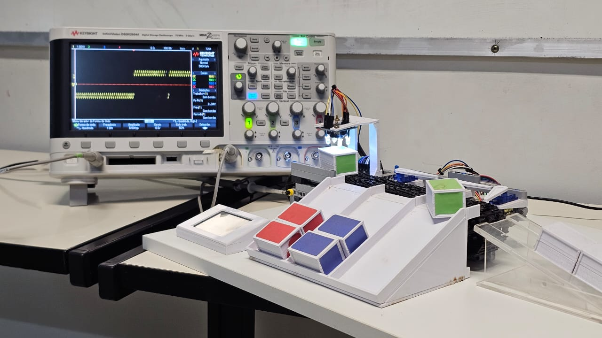
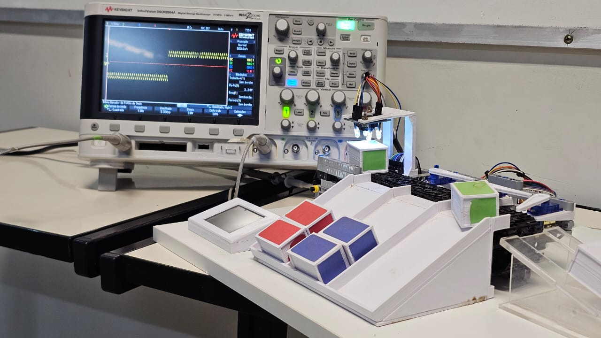
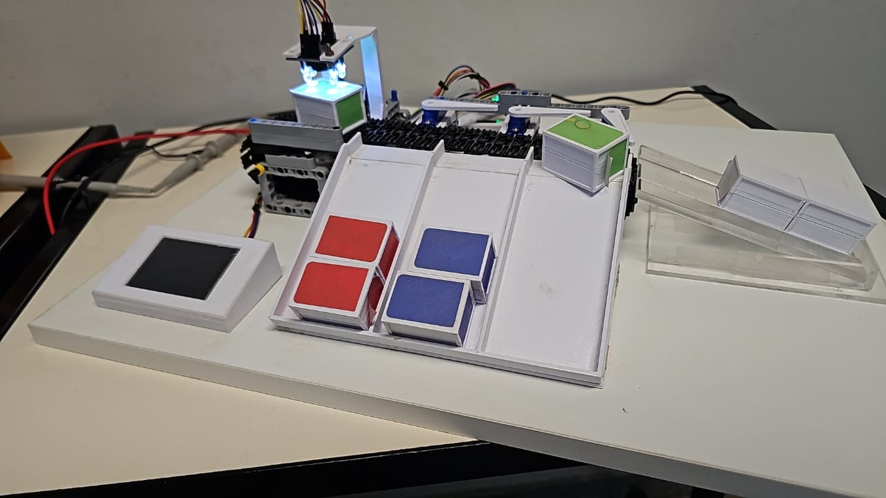

# Etapa 3 – Prototipagem e Ajustes

Este documento registra o desenvolvimento da terceira etapa do projeto, focada na construção e validação do protótipo funcional da nossa solução.

-----

## 1\. Registro da Montagem e Testes

### Fotos da Montagem

### Vídeo de explicativo

Clique na imagem abaixo para assistir ao vídeo.

-----

## 3\. Melhorias Planejadas e Ajustes

Com base nos desafios identificados, listamos os seguintes ajustes e melhorias para a versão final do produto:

| Desafio Correspondente | Melhoria Planejada | Prioridade |
| :--- | :--- | :---: |
| **[Desafio 1]** | Implementar o código dos perifericos de entrada para o microcontrolador RP2040. | Alta |
| **[Desafio 2]** | Elaborar a interface gráfica do Usuario no display TFT. | Alta |